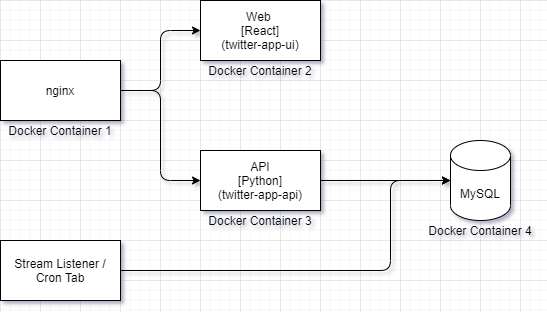

# Twitter Application

This is an simple demo application developed for using Twitter API(s) providing the below functionality.
- User sign in with twitter 
- Application fetches users Twitter timeline and save it to the database
- UI will display the tweets in chronological order from DB
- Sort & filter based on the date on DB
- Ability to search tweets on DB
- Tweets are synced periodically to the database on an interval (crontab)

# Pre-Requisites
Software required to setup the development environment of the application. 
- Docker
- Twitter Developer Portal Access
	- Consumer Key
	- Consumer Secret

# Application Architecture
A high level application architecture view.


# Application Components
The application has got 4 modules.
- twitter-app-nginx 
	- Load Balancer module using nginx to route the request to web or backend
- twitter-app-ui
	- Web interface module using ReactJS
- twitter-app-app
	- Backend Api module supporting the Web using Python
- twitter-app-db
	- Database module to store the tweets using MySQL

# Setup
- Open the **set_secrets.txt** file under project root and update the twitter access keys. MySQL credentials can be left as defaults, if running the application local.
	- Twitter Bearer Token
	- Twitter Consumer Key
	- Twitter Consumer Secret

- Set the callback URL in Twitter Developer Portal as below:

> http://localhost:3000/v1/auth/callback

- Run Docker using the below command. Initial setup takes time, as it will download and setup the container images and database.
```sh
$ docker-compose up
```

- After successful start, open the below URL in browser to access the application.
> http://localhost:3000

- Login with your Twitter Credentials to view the Tweets.
